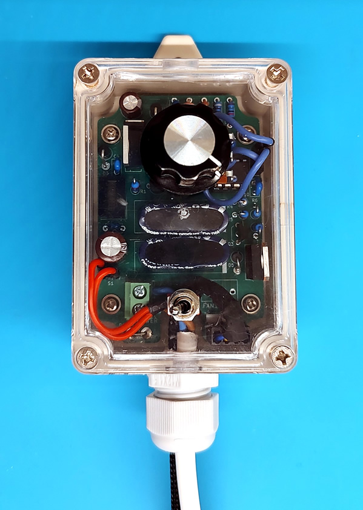

# Solfacon
### An efficient multi-fan controller designed for solar powered sustainable / off-grid ventilation

Feature highlights:
* Low-light operation / assisted fan start
* Adjustable max fan speed - PWM duty cycle calculated on the basis of available voltage and desired fan speed
* Directly connect 1 or 2 fans
* Easy assembly in standard enclosure
* Operating temperatures from -20°C to 50°C
* Easy to configure, modify and hack

Read the details here and configure your own:
https://s0rent.github.io/solfacon/
