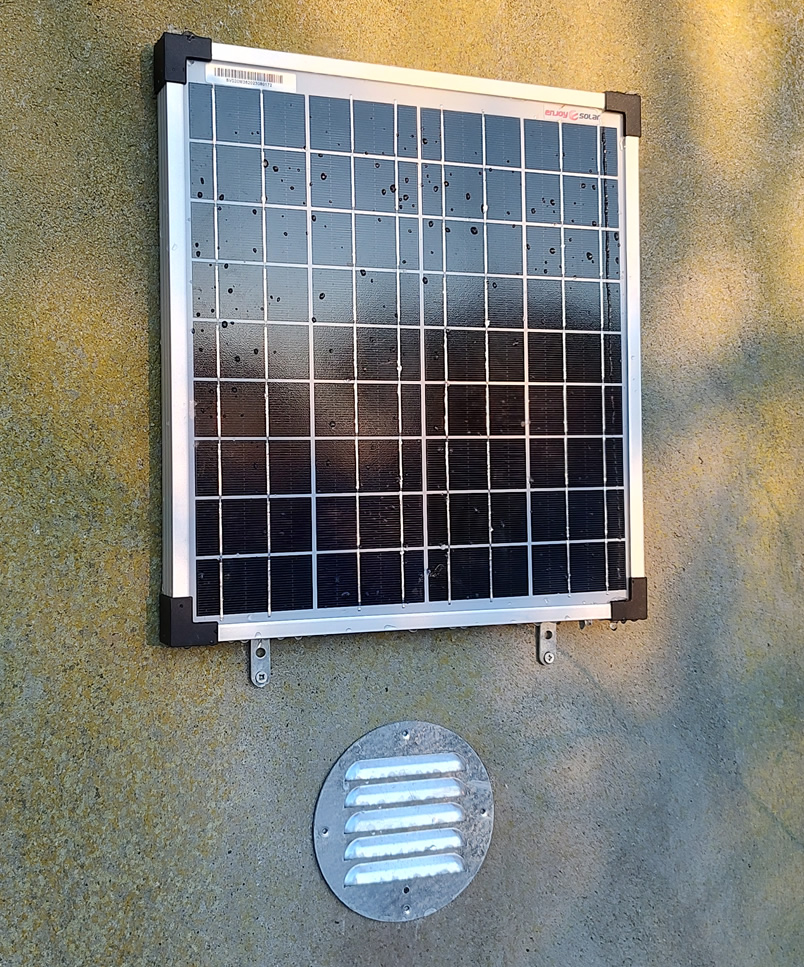

# Solfacon
### An efficient fan controller designed for solar powered sustainable / off-grid ventilation

Feature highlights:
* Low-light operation / assisted fan start
* Adjustable stable fan speed - PWM duty cycle calculated based on available voltage and desired fan speed
* Connect the solar panel and fan(s) directly to the controller (includes fan headers for connecting one or two 3-pin or 4-pin 12V PC fans)
* Configuration tool allows for easy adaptation to any fan make and model (default configuration is for Arctic P12 fans)
* LDO / switch mode combo power regulation for efficient power conditioning - fan operation down to ~4V input voltage
* Easy assembly in standard enclosure with stencil for drilling
* Easy to configure, build, modify and hack

Technical specs:
* Solar panel open circuit voltage: 16V ~ 26V
* Recommended max load: 12W (peak)
* Recommended max total fan power rating: 6W (all fans combined)
* Quiescent current: 5mA
* Operating temperature: -20°C to 50°C
* Fan PWM frequency: 25KHz (Intel PC fan spec)
* MCU: ATtiny85 @ 3.3V

Prerequisites:
* Solar panel
* Fan
* Soldering iron for assembling the controller
* Arduino IDE for flashing the MCU
* ISP for flashing the MCU

Read more here and configure your own using the configuration tool:
https://s0rent.github.io/solfacon/

"Low-light operation / assisted fan start" allows fan start and operation in otherwise difficult conditions, such as partial shade, suboptimal panel angle and at dawn/dusk. The photo above is a setup with a 20W panel and one fan (Arctic P12), and the fan is running continuously despite the panel only being partially exposed to faint sunlight right after dawn. In this situation the panel only supplies around 20mA, but the controller design allows it to buffer enough energy to efficiently start the fan and keep it running.

Software used:  
* KiCad 6.0
* Arduino IDE 2.2.0 (should be compatible with newer versions as well)
* ATtiny package for Arduino IDE (https://github.com/damellis/attiny)

Hardware used:  
* USBtinyISP (it is also possible to use for instance an Arduino as ISP)
